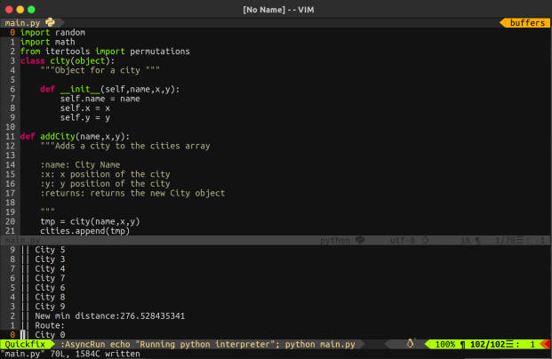

# Sprint
Async file running



## tl;dr
Just like any IDE's run button this plugins just runs your code.

## Dependencies
Sprint relies heavily on @skywind3000 [async run](https://github.com/skywind3000/asyncrun.vim), sprint also relies on Vim 8.0's async functionality. Depending on what language is being used with Sprint you will require a different dependecy check the supported languages area for reference.

- Async run
- Vim 8.0
- Language compilers/interpreters

## What does it do?
Sprint adds a command to vim to allow for asynchronous running of your file, perfect for testing. On compiled formats sprint will compile to the defautl name or use the "sprintFile" name to create a file to run, so make sure no file with this name exists.

## Supported languages and language dependencies

|Languages | Compiler|
|--------|--------|
|C | GCC|
|C++ | G++|
|Python | python|
|Php | php|
|Javascript | node|
|Haskell | ghc|

### Things to consider
In order to compile the contents of the buffer Sprint must save your files before executing. However after executing the file Sprint will delete the file.(Sprint is for quick testing not for final release builds, makefiles are your friend)

## Installing
Use any package manager of your liking if you have Vim 8.0 and Async run. My recommendation is to use vundle with the following code.
```vimL
"This checks for vim 8.0 or above before installing plugins
if v:version >= 800
    Plugin 'skywind3000/asyncrun.vim'
    Plugin 'pedsm/sprint'
endif
```

## Using
Sprint is simple just run :Sprint at any file of the supported languages and watch the result.

## Customizing
If you want Sprints to override running programs(Ideal for programs that run for a long time you can set the following variables on your vimrc.
``` vimL
    let g:SprintForceRun = 1
```
If you want Sprint not to open the quickfix window and you rather open it manually add the folling to your vimrc
``` vimL
    let g:SprintHidden = 1
```


#### To-do
Pull requests are helpful and the code base is small
  - [ ] Add more languages
  - [x] Global variables for copen
  - [ ] Global variables for cw
  - [ ] Global variable for writing the file
  - [x] Global variable for override running process
  - [x] Finish the help help file
  - [ ] Add buffer mode
